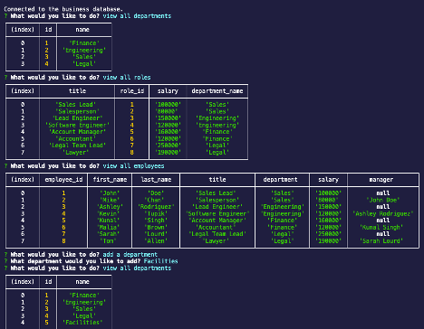

# The Employee Tracker

## Description:
This is a content management systems (CMS) which allows non-developers to easily view and interact with information stored in databases via the command-line interface (CLI).
It provides the ability to view all departments, view all roles, view all employees and their associated data (employee id, salary, manager, etc), add a department, add a role, add an employee, and update an existing employee role.

## Built With
* MySQL
* Node.JS
* Inquirer
* JavaScript

## Screenshot

## Usage
Below is a link to view how to use this app:  
https://youtu.be/K_vxfaBbg1Y

## Contributing
N/A

